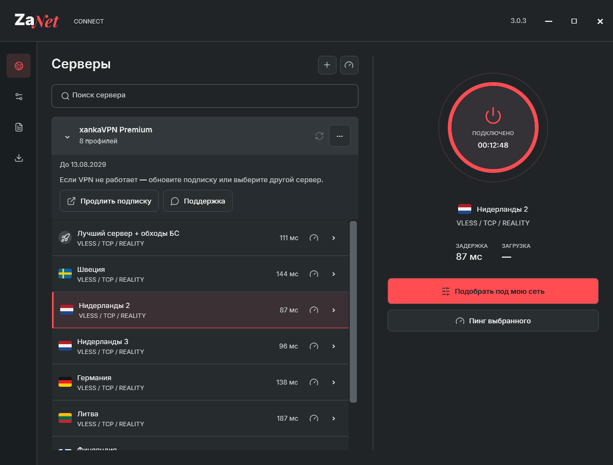
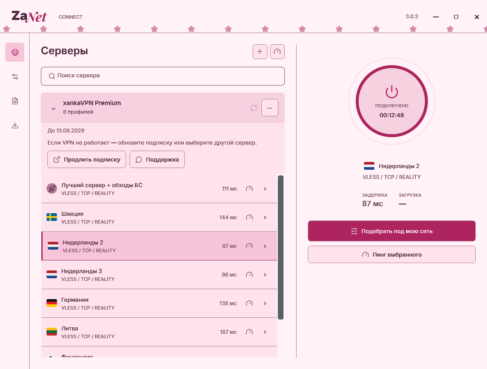
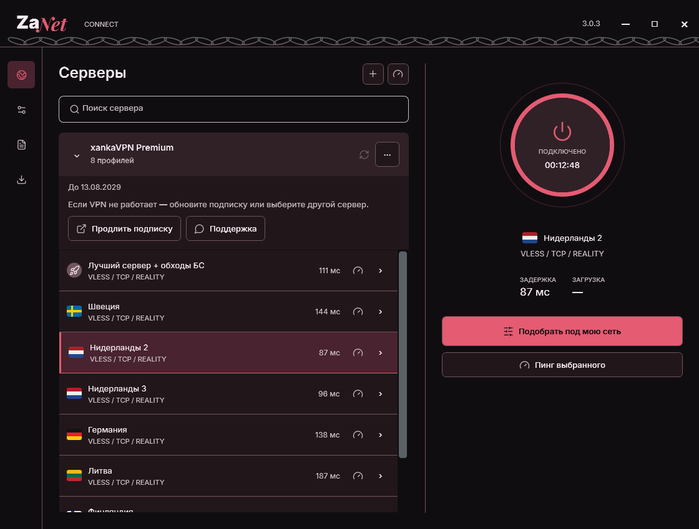
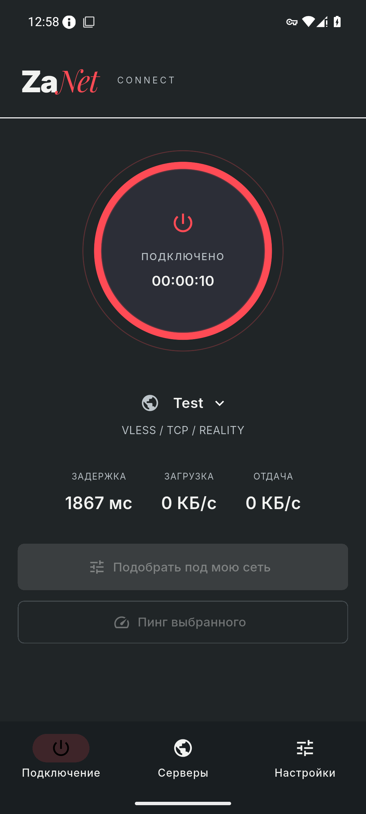

# ZaNet Connect

### За свободный интернет.

VPN-клиент для Windows и Android с управлением подписками, гибкой маршрутизацией и адаптивной настройкой соединения.

[**Скачать для Windows**](https://github.com/sacoq/ZaNet.Connect/releases/download/v3.0.4/ZaNet-Connect-Setup-Windows-x64.exe) · [**Скачать для Android**](https://github.com/sacoq/ZaNet.Connect/releases/download/v3.0.4/ZaNet-Connect-Android-arm64.apk) · [Все релизы](https://github.com/sacoq/ZaNet.Connect/releases)

## Соединение под контролем

Добавьте подписку, выберите сервер и подключитесь. На главном экране доступны состояние VPN, время подключения, задержка и скорость передачи данных. Список серверов можно свернуть стрелкой; на Android он открывается выдвижной панелью прямо с экрана подключения.

| Возможность | Windows | Android |
|:--|:--:|:--:|
| Импорт и обновление подписок | ✓ | ✓ |
| Поиск и проверка серверов | ✓ | ✓ |
| Настройки DNS и маршрутизации | ✓ | ✓ |`r`n| Маршруты приложений Proxy / Direct / Block | — | ✓ |
| Подбор параметров соединения | ✓ | ✓ |
| Темы оформления и анимации | ✓ | ✓ |
| Уведомления об обновлениях | ✓ | ✓ |
| Встроенное ядро Xray | ✓ | ✓ |
| Ядро Mihomo | ✓ | — |

## Адаптивная настройка

На Android клиент перед первым подключением выполняет короткую проверку выбранного профиля через YouTube. Если профиль доступен, VPN запускается сразу. Если проверка не пройдена, клиент предлагает выбрать другой сервер или вручную запустить подбор альтернативных настроек. Подбор учитывает DNS, IP-стратегию и параметры туннеля, а результат подтверждается передачей данных через реальный VPN-туннель.

Подбор можно запустить вручную кнопкой **«Подобрать под мою сеть»**. Доступность соединения зависит от сети и сервера подписки.

## Интерфейс, который можно настроить

Классический **ZaNet** — оформление по умолчанию: тёмный фон, красные акценты и светящееся кольцо подключения. В разделе кастомизации доступны ещё пять тем с собственными цветами и анимациями.

| Тема | Оформление |
|:--|:--|
| **Сакура** | Пастельно-розовая палитра и цветочные элементы |
| **Тёмный принц** | Глубокие тёмные оттенки, бордовые акценты и цепи |
| **Северное сияние** | Холодная палитра и переливы света |
| **Океан** | Синие оттенки и волновая анимация |
| **Бумага** | Светлый минималистичный интерфейс |

<table>
<tr><td></td><td></td></tr>
<tr><td align="center">Сакура</td><td align="center">Тёмный принц</td></tr>
</table>

Декоративные элементы можно отключить. Кнопка подключения показывает состояние VPN независимо от выбранной темы.

## Android

Встроенное ядро, управление подписками и настройка соединения доступны в одном приложении. APK содержит всё необходимое для работы клиента — отдельно устанавливать ядро не нужно.

Скриншоты показывают интерфейс с демонстрационными профилями; набор серверов определяется вашей подпиской.

## Установка

### Windows

1. Скачайте [установщик EXE](https://github.com/sacoq/ZaNet.Connect/releases/download/v3.0.4/ZaNet-Connect-Setup-Windows-x64.exe) и выполните установку.
2. Запустите ZaNet Connect и добавьте ссылку подписки.
3. Выберите сервер и нажмите кнопку подключения.

Для установки через MSI доступен [отдельный пакет](https://github.com/sacoq/ZaNet.Connect/releases/download/v3.0.4/ZaNet-Connect-Windows-x64.msi). Сборка предназначена для Windows x64.

### Android

1. Скачайте [APK](https://github.com/sacoq/ZaNet.Connect/releases/download/v3.0.4/ZaNet-Connect-Android-arm64.apk). Требуется **Android 7.0 или новее**, ARM64.
2. Разрешите установку из выбранного браузера или файлового менеджера, если Android запросит это разрешение.
3. Добавьте подписку, нажмите подключение и подтвердите системный запрос на создание VPN.

ZaNet Connect — клиент для подключения к серверам. Для работы нужна действующая подписка или совместимый профиль.

## Обновления

При появлении новой версии клиент показывает уведомление с кнопкой **«Обновить»**. Подписки и настройки сохраняются при установке обновления поверх приложения. На Android установку подтверждает системный установщик.

Сборки, отмеченные на GitHub как **Pre-release**, относятся к предварительному каналу. История изменений и файлы доступны на [странице релизов](https://github.com/sacoq/ZaNet.Connect/releases).

## Поддержка

[Создать обращение](https://github.com/sacoq/ZaNet.Connect/issues) · [История версий](https://github.com/sacoq/ZaNet.Connect/releases)

В обращении укажите версию приложения, операционную систему, последовательность действий и текст ошибки. Перед публикацией диагностики удалите личные данные, ссылки подписок и ключи доступа.

## Проверка файлов и лицензии

Каждый релиз содержит файл `SHA256SUMS.txt` с контрольными суммами установщиков и его RSA-подпись `SHA256SUMS.txt.sig`.

Этот репозиторий предназначен для распространения готовых сборок и документации. Лицензии сторонних компонентов сохраняют действие; соответствующие уведомления и исходники модифицированных сторонних ядер включены в Windows-дистрибутив.

